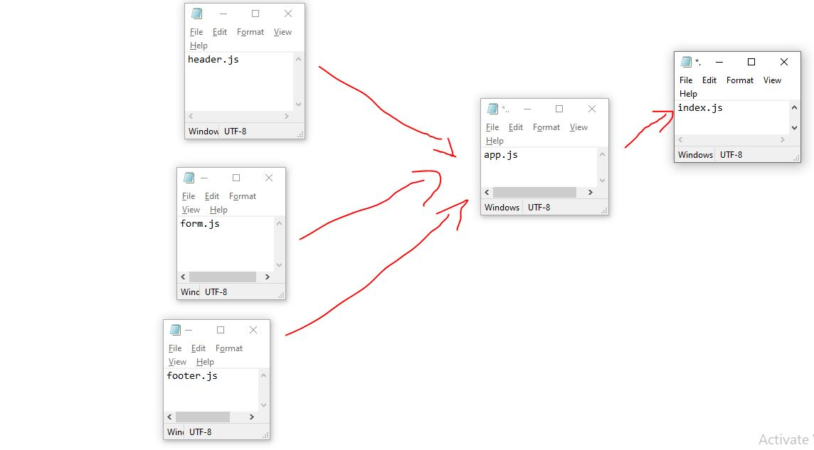

# LAB - Class 27

## Project:  Component Based UI

### Author: Ruwaid al sayyed obeid

### Links and Resources

- [submission PR](https://github.com/ruwaid-401-advanced-javascript/resty/pull/3)
- [Github actions](https://github.com/ruwaid-401-advanced-javascript/resty/pull/3/checks)
- [live URL](https://ruwaid-401-advanced-javascript.github.io/resty/)

## Modules
### index.js
### app.js
### header.js
### footer.js

### Setup

#### How to initialize/run your application 
* `npm start`
* EndPoint: `/` 

#### UML

